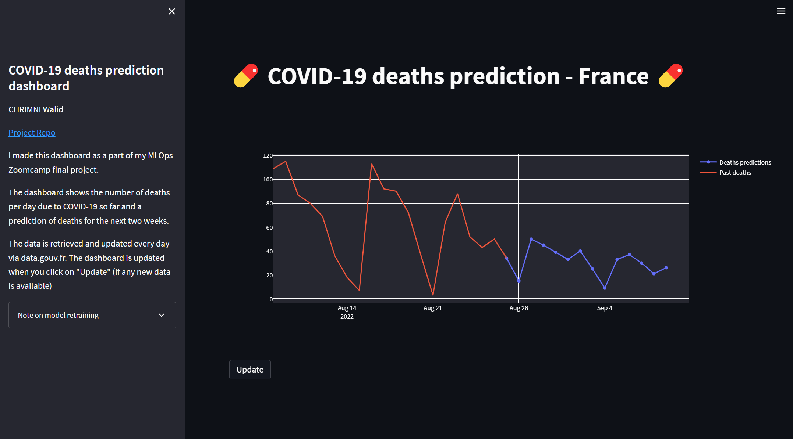

# Covid19 deaths prediction for MLOps zoomcamp's project

This is my final project for both the MLOps Zoomcamp from Data Talks Club. My course works are available in [this other repo](https://github.com/WLDCH/mlops-zoomcamp).

# Project framing

## Objective

Covid19 has struck every country in the world since late 2019/early 2020. Over 6M people have died since then, and everyday, new people die from covid19.

<b>The goal of this project is to predict the daily number of deaths due to covid19 in the next two weeks in France. </b> The project utilizes MLOps to create a system that predicts the number of deaths due to covid19 and is updated every day. A new model is retrained with new data every Monday at 20:00.

## Datasets

Two datasets are used in this project. They are scrapped directly from www.data.gouv.fr/. They are updated every day (except weekends) at 19:00, so each day after 19:00 we can update streamlit dashboard to have new predictions.

* French covid19 indicators synthesis : https://www.data.gouv.fr/fr/datasets/synthese-des-indicateurs-de-suivi-de-lepidemie-covid-19/
  * This dataset includes most of the summary indicators for monitoring the COVID-19 epidemic in France.
* French covid19 screening : https://www.data.gouv.fr/fr/datasets/donnees-de-laboratoires-pour-le-depistage-a-compter-du-18-05-2022-si-dep/
  * The virological surveillance indicators are derived from the screening information system (SI-DEP), whose objective is to report test data (RT-PCR) performed by all city laboratories and hospitals concerning SARS-COV2, as well as antigenic tests performed by laboratories, pharmacists, physicians and nurses.

## MLOps

The project uses tools and concepts from MLOps. Once a week, every Monday at 20:00, three differents models of Deep Learning using Darts library are trained (Transformer, RNN & TCN). The process is automated with Prefect Deployment.

We use experiment & model registery with MLFlow with a remote tracking server on GCP. We use a VM as tracking server, SQL database as Backend Store and Google Cloud Storage Bucket as Artifact Store.

Each time we request a prediction, the script pulls the last model of each DL model and take the model with lowest MAE, then perform the prediction.

## Tools

* Cloud - [Google Cloud Platform (Bucket, SQL Storage, VM)](https://www.google.com/cloud)
* Containerization - [Docker](https://www.docker.com)
* Workflow Orchestration - [Prefect](https://www.prefect.io/)
* Data Visualization/Dashboard - [Streamlit](https://streamlit.io/) and [Plotly](https://plotly.com/) 
* Model Development, Experiment Tracking, and Registration - [Darts](https://unit8co.github.io/darts/) and [MLflow](https://www.mlflow.org/)
* Model Deployment - [Darts](https://unit8co.github.io/darts/), [Prefect](https://www.prefect.io/),  [MLflow](https://www.mlflow.org/), [Streamlit](https://streamlit.io/)
* Tests - [Pytest](https://docs.pytest.org/en/7.1.x/)
* Code formating - [Black](https://github.com/psf/black) & [isort](https://isort.readthedocs.io/en/latest/)

# Dashboard

<b> As I am using free GCP credit, I might run out of credit by the time you see the dashboard </b>

You can acces the dashboard [here](http://35.210.155.194:8501/). It contains a graphic that shows current covid19 deaths and predictions by the model.
After reproducing, you can run the dashboard with `make streamlit-dashboard`

# Steps to reproduce

## Chromedriver

First you have to install chromedriver & chrome. There are plenty tutorial on the internet so I will skip this part

## Setup environment

Then you have to setup the environment install packages & dependencies. For this, you can use the Makefile :

`make setup`

## Set GCP remote server

The next step is to create the remote tracking server with artifacts & backend store. As mentionned before, we use a VM as tracking server, Database as Backend Store and Google Cloud Storage Bucket as Artifact Store. If you already have these three set, you can just set env variables `TRACKING_SERVER_HOST` (remote VM's IP) and `BUCKET_NAME` (self-explanatory) with your own values. 

If you have never set GCP for experiment tracking, you can follow this great tutorial https://kargarisaac.github.io/blog/mlops/data%20engineering/2022/06/15/MLFlow-on-GCP.html

If you don't want to use remote tracking server and juste want to run everything locally, you can set the env variables `LOCALLY` to `True` and the script will pull the models from blob_checkpoints (which are models from GCP buckets that I store here on purpose)

## Run dashboard

When everything is set, you can run the streamlit dashboard with `make streamlit-dashboard`

